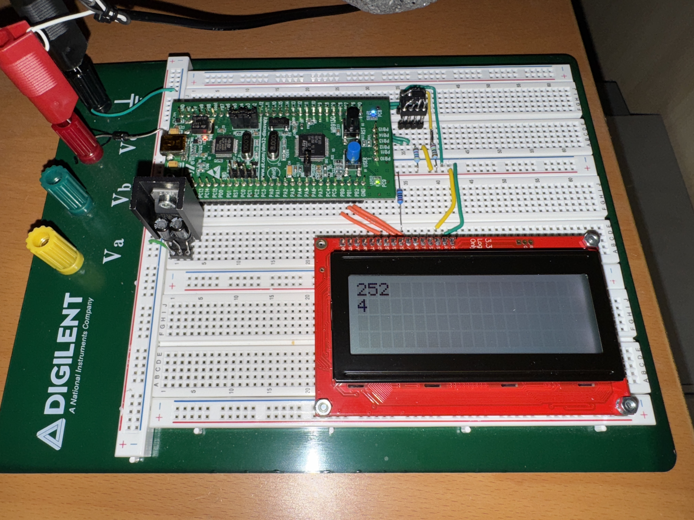

Osek_pi_crunch_cm3
==================

<p align="center">
    <a href="https://github.com/ckormanyos/Osek_pi_crunch_cm3/actions">
        </a>
</p>

This repository uses an OSEK-like OS on bare-metal ARM(R) Cortex(R)-M3 to calculate $\pi$
with a spigot algorithm.

Osek_pi_crunch_cm3 is a fascinating, educational and fun project
that computes up to $100,001$ decimal digits of $\pi$
on a bare-metal ARM(R) Cortex(R)-M3 system.

The backbone real-time operating system is taken directly
from the OSEK-like OS implemented in
[Chalandi/OSEK](https://github.com/Chalandi/OSEK)

# Software Details

To compute $\pi$, we use a (slow) quadratic pi-spigot algorithm
of order $N^2$ in this project. The spigot calculation
(having quadratic order) is slower than other well-known algorithms
such as AGM or fast series.

The required memory grows linearly with the digit count.
Approximately 1.4 Mbyte RAM are needed for the full $10^{5}$
decimal-digit calculation. Since this is significantly more RAM
than is available on-chip, a slow external serial SPI SRAM is used
for storage.

GNU/GCC `gcc-arm-non-eabi` is used for target system
development on `*nix`. The build system is based on
Standard GNUmake/shell-script.

## Building the Application

### Build with GNUmake on `*nix`

Build on `*nix*` is easy using an installed `gcc-arm-none-eabi`

```sh
cd Osek_pi_crunch_cm3
./Build.sh
```

The build results including ELF-file, HEX-mask, MAP-file
can be found in the `Output` directory following the GNUmake build.

If `gcc-arm-none-eabi` is not present, then it can be installed (if needed).

```sh
sudo apt install gcc-arm-none-eabi
```

# Prototype Project

This repo features a fully-worked-out prototype example project.
The prototype runs on an ARM(R) Cortex(R)-M3 controller fitted on the
SMT32F100RB-NUCLEO board. The board is driven in OS-less, bare-metal mode.

The $\pi$-spigot calculation runs continuously and successively
in the low-priority idle task (`Idle`). Upon successful calculation completion,
pin PB9 is toggled. This provides a measure of success viewable
with a digital oscilloscope.

Simultaneously task `T1` exercises a perpetual, simple blinky show
featuring the two user LEDs (green and blue) toggling at 1/2 Hz.
This provides clear visual indication of both system-OK as well as
numerical correctness of the most-recently finished spigot calculation.

# Hardware Setup

The hardware setup is pictured in the image below.



Bit banging is used to implement an all-software, SPI-compatible
driver which controls the external SRAM memory chip. A significant
amount of external SRAM is needed to hold the potentially very large
data array used for the $\pi$-calculation's intermediate storage.

The output pin connections from the board to the SRAM chip
are shown in the table below.

| NUCLEO PIN    | SRAM PIN  | SPI Function               |
| ------------- | --------- | -------------------------- |
| PA11          | 1         | CE (chip-select-not)       |
| PA10          | 2         | SO (chip-serial-out)       |
| PA09          | 6         | CLK (chip-serial-clock)    |
| PA08          | 5         | SI (chip-serial-in)        |

# _Bonus_ Generic Serial SPI SRAM driver

The serial SRAM driver is a nice _by_-_product_ of this project.

It has been written in C++14 utilizing a fully generic,
multi-chip, variable-page-size, template form.
This driver can be found in the file
[mcal_memory_sram_generic_spi.h](./Application/ref_app/src/mcal_memory/mcal_memory_sram_generic_spi.h).

Using this SRAM driver requires providing an independent
SPI driver having particular interface functions such as
`read()`/`write()` and `read_n()`/`write_n()` for reading
and writing single-byte or multiple-byte streams.


# Licensing

The operating system [OSEK](./Application/OS) and timer files in the [MCAL](./Application/MCAL)
are licensed under [GPL](./gpl-3.0.txt).
This is consistent with the licensing found in and adopted from
[Chalandi/OSEK](https://github.com/Chalandi/OSEK).

The supporting files in [ref_app](./Application/ref_app) and
the [pi_spigot](./Application/pi_spigot) application itself
are licensed under [BSL](./LICENSE_1_0.txt).
